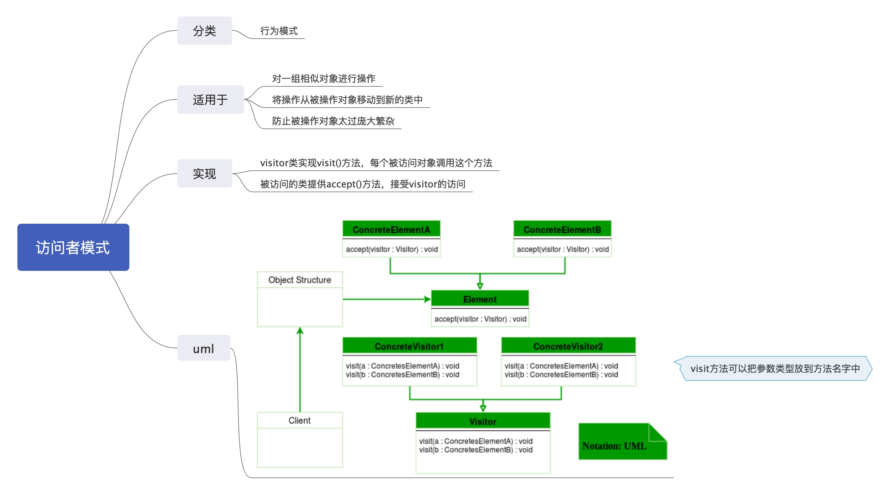

# 访问者模式

see [访问者模式](https://www.runoob.com/design-pattern/visitor-pattern.html)

在访问者模式（Visitor Pattern）中，我们使用了一个访问者类，它改变了元素类的执行算法。  
通过这种方式，元素的执行算法可以随着访问者改变而改变。这种类型的设计模式属于行为型模式。  
访问者模式可以给一系列对象透明的添加功能，并且把相关代码封装到一个类中。  
对象只要预留访问者接口`Accept`则后期为对象添加功能的时候就不需要改动对象。

